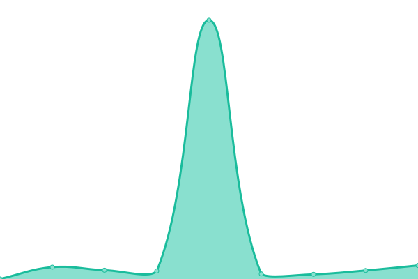

# [📈 Live Status](https://Nun-z.github.io/NodeAzureUpptime): <!--live status--> **🟩 All systems operational**

This repository contains the open-source uptime monitor and status page for [Nun-z](https://Nun-z.github.io/NodeAzureUpptime), powered by [Upptime](https://github.com/upptime/upptime).

With [Upptime](https://upptime.js.org), you can get your own unlimited and free uptime monitor and status page, powered entirely by a GitHub repository. We use [Issues](https://github.com/Nun-z/NodeAzureUpptime/issues) as incident reports, [Actions](https://github.com/Nun-z/NodeAzureUpptime/actions) as uptime monitors, and [Pages](https://Nun-z.github.io/NodeAzureUpptime) for the status page.

<!--start: status pages-->
<!-- This summary is generated by Upptime (https://github.com/upptime/upptime) -->
<!-- Do not edit this manually, your changes will be overwritten -->
<!-- prettier-ignore -->
| URL | Status | History | Response Time | Uptime |
| --- | ------ | ------- | ------------- | ------ |
|  [Node Azure](https://azurepipelineconnection.azurewebsites.net/) | 🟩 Up | [node-azure.yml](https://github.com/Nun-z/NodeAzureUpptime/commits/HEAD/history/node-azure.yml) | 

 194ms
     
 | 

<a href="https://Nun-z.github.io/NodeAzureUpptime/history/node-azure">100.00%</a>
    

|  [Azure DevOps organization](https://dev.azure.com/Nun-z) | 🟩 Up | [azure-dev-ops-organization.yml](https://github.com/Nun-z/NodeAzureUpptime/commits/HEAD/history/azure-dev-ops-organization.yml) | 

 323ms
     
 | 

<a href="https://Nun-z.github.io/NodeAzureUpptime/history/azure-dev-ops-organization">99.85%</a>
    

<!--end: status pages-->

RetroArch: Store package (unstable), Store package (stable), dev mode package, CI on commit

PPSSPP: Store package, dev mode package, CI on commit

Update RetroArch cores:

